哈喽！我是二狗子（2🐕）！这是一套comfyui的多功能自定义节点套件，涵盖了提示词管理，水印添加，图像细化，指定保存图像路径，常规文本、图像处理等33个节点   
Hello! I am Er Gouzi （2🐕）！This is a multifunctional custom node kit from Comfyui, covering 33 nodes including prompt word management, watermark addition, image refinement, specified image saving path, regular text and image processing, etc

## 安装
Installation

首先，打开命令行终端，然后切换到您的ComfyUI的`custom_nodes`目录：   
Firstly, open the command line terminal and then switch to the 'custom_dodes' directory in your ComfyUI:   

```cd /path/to/your/ComfyUI/custom_nodes```

将/path/to/your/ComfyUI替换为您的ComfyUI项目所在的实际路径。   
Replace/path/to/your/ComfyUI with the actual path where your ComfyUI project is located.   
接下来，克隆ergouzi-DGNJD仓库：   
Next, clone the ergouzi DGNJD repository:   

```git clone https://github.com/11dogzi/Comfyui-ergouzi-Nodes.git```

## 节点介绍   
Node Introduction   
如果你需要中文版可以到[二狗子的节点组中文版](https://github.com/11dogzi/Comfyui-ergouzi-DGNJD)     
 ## 提示词大师：
Hint Word Master:   
众多可选类型提示词节点，可随机   
Numerous optional types of prompt word nodes that can be randomly selected   
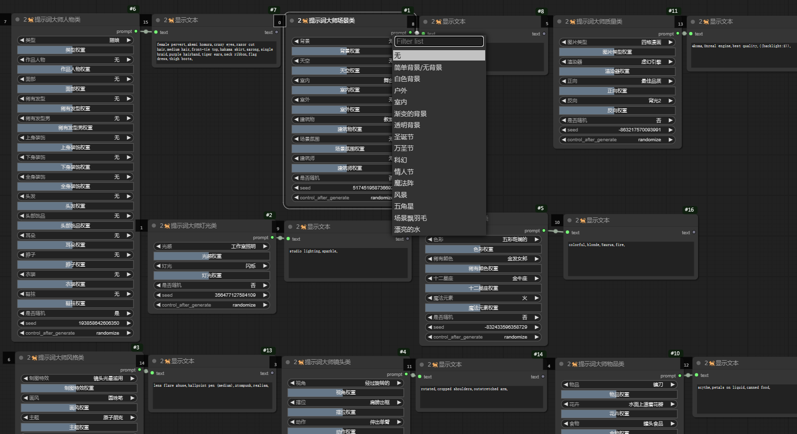   
自定义类型随机提示词节点，可根据需求选择类型，然后随机   
Custom type random prompt word node, you can choose the type according to your needs, and then randomly   
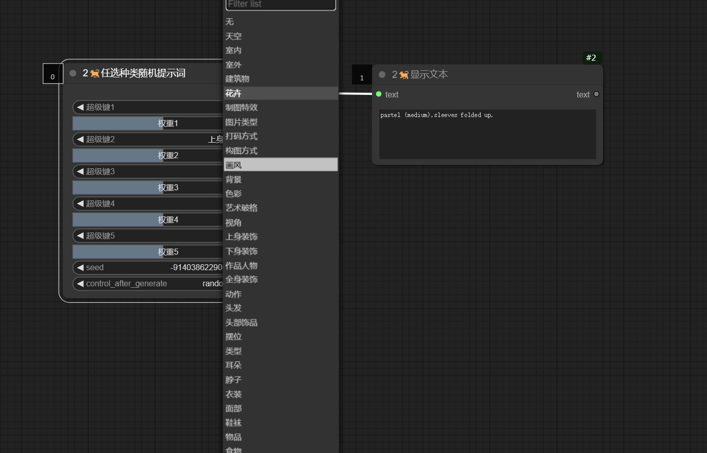   
提示词模板管理器，可快捷删除保存修改提示词模板   
Prompt word template manager, which can quickly delete, save, and modify prompt word templates   
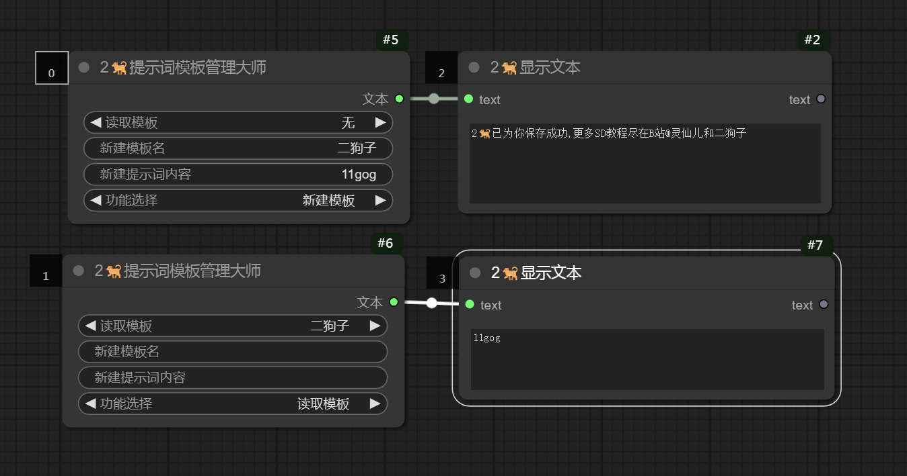   
文本自由拼接节点，配合提示词模板使用更加自由的使用提示词   
Free text splicing nodes, combined with prompt word templates for more flexible use of prompt words   
   
可保存下列图像以加载工作流   
The following images can be saved to load the workflow   
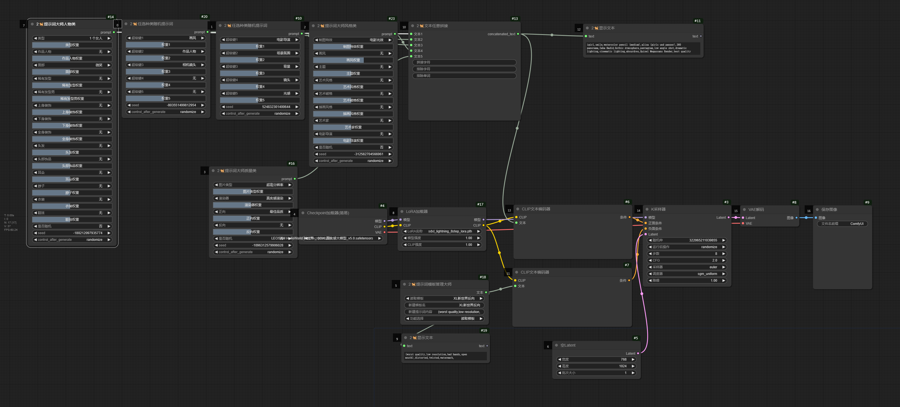       


 ## 细化处理节点：
Refine processing nodes:   
更自由的局部处理方式，可对遮罩区域进行裁剪，自动识别裁剪区域，通过其它节点处理拼接回原图，配合语义分割等效果更佳！   
A more flexible local processing method that can crop the masked area, automatically recognize the cropped area, and process it back to the original image through other nodes, with better results such as semantic segmentation!   
以下是两个使用案例   
Here are two use cases   
局部修复   
Local repair   
通过涂抹需修复区域完成任意局部修复   
Complete any local repair by applying the area to be repaired   
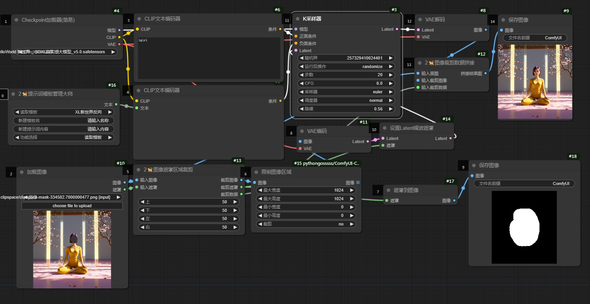   

     
    

可保存下列图像以加载工作流   
The following images can be saved to load the workflow   
   

内补绘制   
Internal supplement drawing   
配合控制网等插件完成局部绘制   
Collaborate with control network and other plugins to complete local drawing   
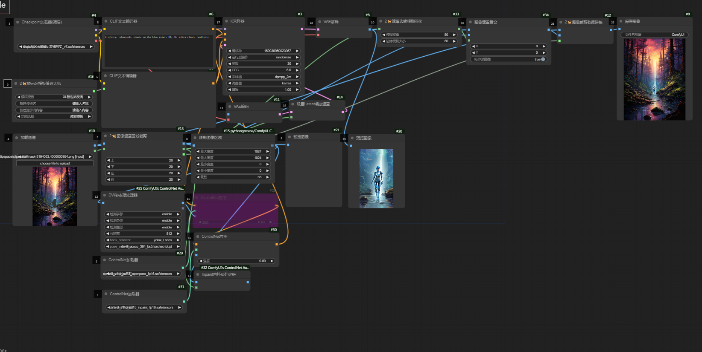   

     
    

可保存下列图像打开工作流   
The following images can be saved to open the workflow   
   

 ## 水印大师：
Watermark Master:   
无论是生成文字水印，还是上传成品水印，通通可以实现，配合批量加载图像可以批量添加！   
Whether it's generating text watermarks or uploading finished product watermarks, it can all be achieved, and with batch loading of images, it can be added in batches!   
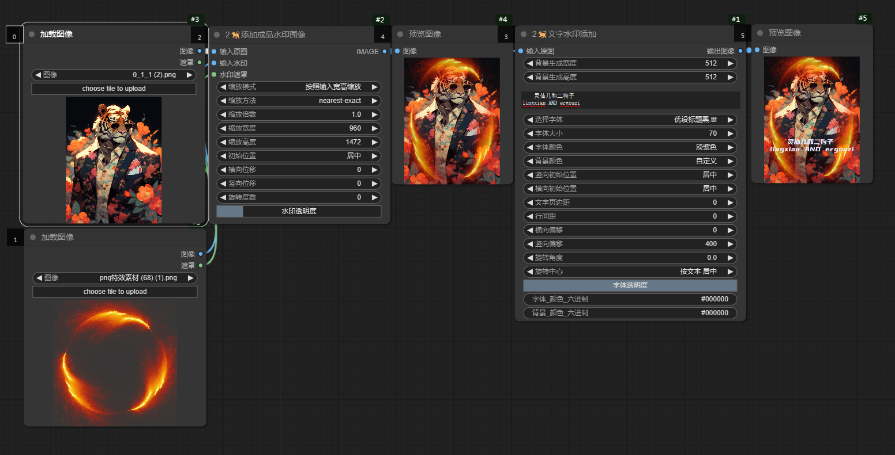   

 ## 常规图像处理节点：
Conventional image processing nodes:   
现在我们可以指定图像的保存路径了！   
Specify image save path:   
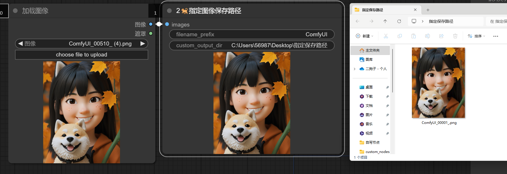  
加载任意图像！文件或者文件夹！包括psd，而且可以实时更新！    
Load any image! File or folder! Including PSD, and can be updated in real-time!    
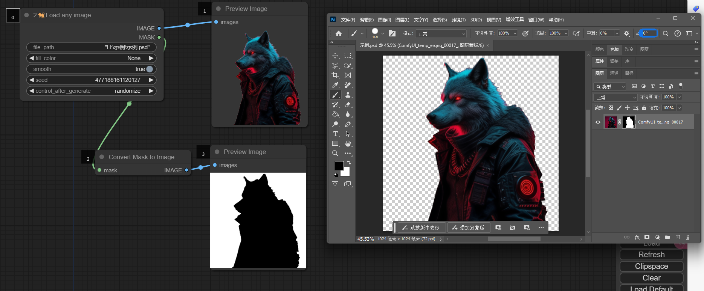     
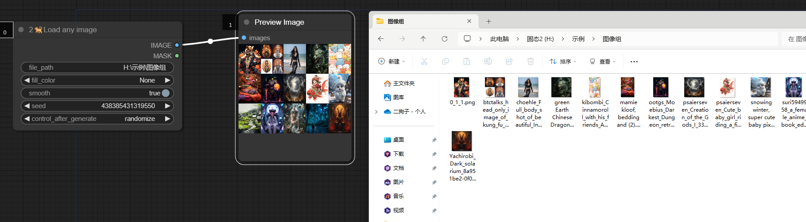     
颜色迁移     
Color migration   
   
图像尺寸获取   
Image size acquisition   
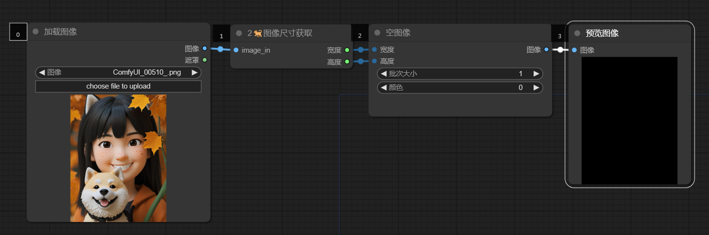   
镜像翻转   
Mirror Flip   
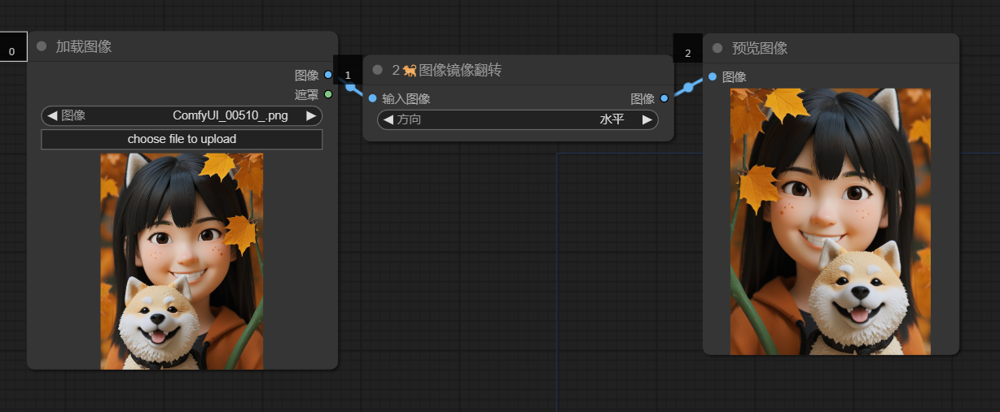   

 ## 常规遮罩处理节点：
Regular mask processing nodes:   
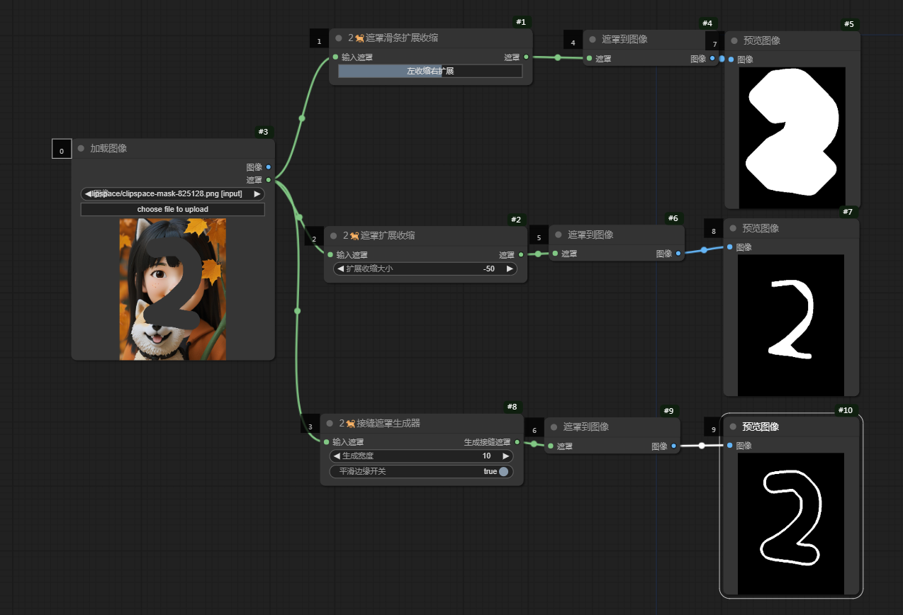   
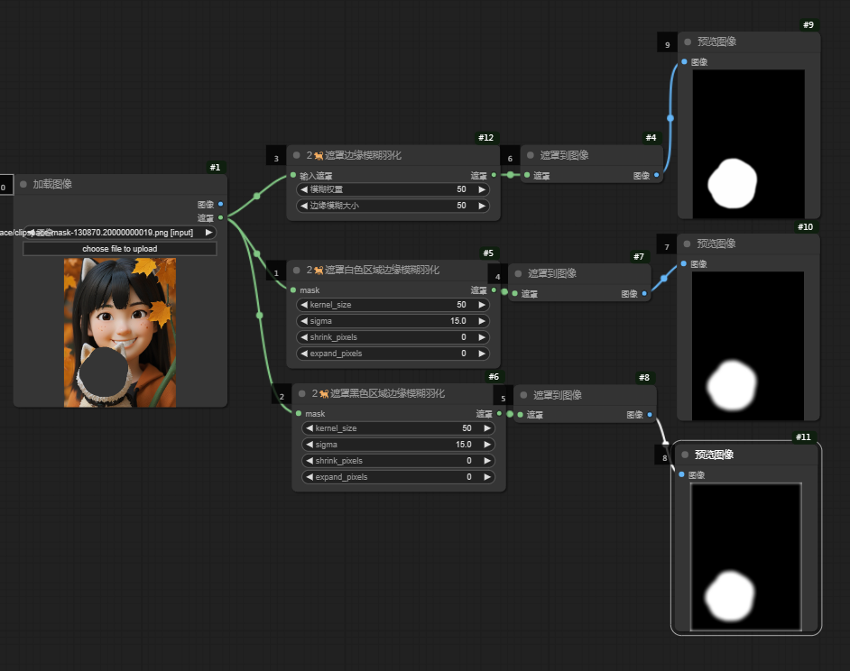  

 ## 百度翻译API：
Baidu Translation API:   
仅第一次使用需要输入id和key   
Only the first use requires entering the ID and key   
申请百度翻译API，请访问：[百度翻译API申请链接](https://fanyi-api.baidu.com/?aldtype=16047&ext_channel=Aldtype&fr=pcHeader)   

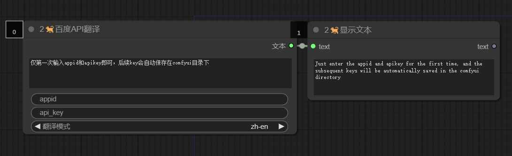   


## 更多SD免费教程
More SD free tutorials   
灵仙儿和二狗子的Bilibili空间，欢迎访问：   
Bilibili space for Lingxian'er and Ergouzi, welcome to visit:   
[灵仙儿二狗子的Bilibili空间](https://space.bilibili.com/19723588?spm_id_from=333.1007.0.0)   
欢迎加入我们的QQ频道，点击这里进入：   
Welcome to our QQ channel, click here to enter:   
[二狗子的QQ频道](https://pd.qq.com/s/3d9ys5wpr)   


