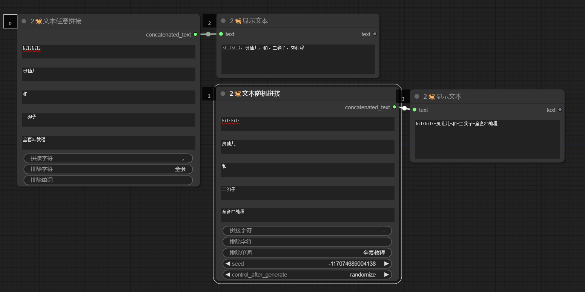
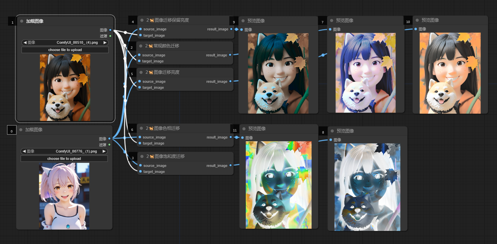

哈喽！我是二狗子（2🐕）！这是一套comfyui的多功能自定义节点套件，涵盖了提示词管理，水印添加，图像细化，指定保存图像路径，常规文本、图像处理等33个节点
Hello! I am Er Gouzi （2🐕）！ This is a multifunctional custom node kit from Comfyui, covering 33 nodes including prompt word management, watermark addition, image refinement, specified image saving path, regular text and image processing, etc
## 安装
首先，打开命令行终端，然后切换到您的ComfyUI的`custom_nodes`目录：
```cd /path/to/your/ComfyUI/custom_nodes```
将/path/to/your/ComfyUI替换为您的ComfyUI项目所在的实际路径。
接下来，克隆ergouzi-DGNJD仓库：
```git clone https://github.com/11dogzi/Comfyui-ergouzi-DGNJD.git```

## 节点介绍
 ## 提示词大师：
众多可选类型提示词节点，可随机

自定义类型随机提示词节点，可根据需求选择类型，然后随机

提示词模板管理器，可快捷删除保存修改提示词模板

文本自由拼接节点



 ## 细化处理节点：
更自由的局部处理方式，可对遮罩区域进行裁剪，自动识别裁剪区域，通过其它节点处理拼接回原图，配合语义分割等效果更佳！
以下是两个使用案例
局部修复
通过涂抹需修复区域完成任意局部修复


   

可保存下列图像以加载工作流


内补绘制
配合控制网等插件完成局部绘制


   

可保存下列图像打开工作流


 ## 水印大师：
无论是生成文字水印，还是上传成品水印，通通可以实现，配合批量加载图像可以批量添加！


 ## 常规图像处理节点：
指定图像保存路径

颜色迁移，注意部分迁移需保证图像大小一致！

图像尺寸获取

镜像翻转


 ## 常规遮罩处理节点：


 ## 百度翻译API：
仅第一次使用需要输入id和key
申请百度翻译API，请访问：[百度翻译API申请链接](https://fanyi-api.baidu.com/?aldtype=16047&ext_channel=Aldtype&fr=pcHeader)


还有遮罩边缘羽化模糊等小件

## 更多SD免费教程
灵仙儿和二狗子的Bilibili空间，欢迎访问：[灵仙儿二狗子的Bilibili空间](https://space.bilibili.com/19723588?spm_id_from=333.1007.0.0)

欢迎加入我们的QQ频道，点击这里进入：[二狗子的QQ频道](https://pd.qq.com/s/3d9ys5wpr)


